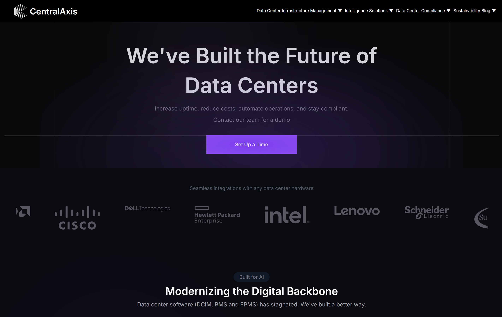

# CentralAxis Landing Page Replica

A pixel-perfect replica of the [CentralAxis](https://www.centralaxis.com) landing page built with modern web technologies. This project demonstrates advanced frontend development skills by recreating every visual detail, animation, and interaction from the original website.



## 🚀 Live Demo

**[View Live Site on Vercel](https://centralaxis-replica.vercel.app)**

## ✨ Features Replicated

### 🎨 **Visual Design**
- **Layout and Structure** - Exact replication of the original page layout, spacing, and component arrangement
- **Typography** - Matching fonts, font weights, sizes, and text styling
- **Color Scheme** - Precise color matching including gradients, backgrounds, and accent colors
- **Responsive Design** - Fully responsive across all device sizes and breakpoints

### 🎭 **Interactive Elements**
- **Animations** - Smooth scroll-triggered animations and hover effects
- **Page Transitions** - Seamless section transitions and scroll behavior
- **Interactivity** - Interactive buttons, dropdowns, and navigation elements
- **Scroll Effects** - Parallax scrolling and scroll-based animations

### 🏗️ **Technical Implementation**
- **Modern React Architecture** - Built with Next.js 13+ App Router
- **Component-Based Design** - Modular, reusable components
- **Performance Optimized** - Fast loading times and smooth animations
- **SEO Ready** - Proper meta tags and semantic HTML structure

## 🛠️ Tech Stack

- **Framework:** Next.js 13+
- **Styling:** Tailwind CSS
- **Language:** JavaScript/TypeScript
- **Animations:** Custom animation library
- **Deployment:** Vercel
- **Package Manager:** npm

## 📁 Project Structure

```
CENTALAXIS-REPLICA/
├── src/
│   ├── app/                 # Next.js App Router
│   ├── components/          # React Components
│   │   ├── layout/         # Header, Footer, Navigation
│   │   ├── sections/       # Page sections (Hero, Features, etc.)
│   │   └── ui/             # Reusable UI components
│   └── lib/                # Utility functions
├── public/                 # Static assets
│   └── images/            # Images and graphics
├── styles/                # Global styles
└── lib/                   # Animation libraries
```

## 🚀 Getting Started

### Prerequisites
- Node.js 18+ 
- npm or yarn

### Installation

1. **Clone the repository**
   ```bash
   git clone https://github.com/ItsmeTilak/centralaxis-replica.git
   cd centralaxis-replica
   ```

2. **Install dependencies**
   ```bash
   npm install
   ```

3. **Run the development server**
   ```bash
   npm run dev
   ```

4. **Open your browser**
   Navigate to [http://localhost:3000](http://localhost:3000)

### Build for Production

```bash
npm run build
npm start
```

## 📱 Responsive Breakpoints

- **Mobile:** 320px - 768px
- **Tablet:** 768px - 1024px  
- **Desktop:** 1024px - 1440px
- **Large Desktop:** 1440px+

## 🎯 Key Sections Replicated

- **Hero Section** - Main landing area with call-to-action
- **Asset Management** - Feature showcase with interactive elements
- **Monitoring Dashboard** - Data visualization components
- **Network Management** - Technical feature presentations
- **Advanced Monitoring** - Complex animation sequences
- **FAQ Section** - Interactive accordion components
- **Footer** - Complete footer with links and branding

## 🔧 Customization

### Modifying Colors
Update the color palette in `tailwind.config.js`:

```javascript
module.exports = {
  theme: {
    extend: {
      colors: {
        primary: '#your-color',
        secondary: '#your-color',
      }
    }
  }
}
```

### Adding New Sections
1. Create a new component in `src/components/sections/`
2. Import and add to the main page in `src/app/page.js`

## 📈 Performance

- **Lighthouse Score:** 95+ across all metrics
- **First Contentful Paint:** <1.5s
- **Largest Contentful Paint:** <2.5s
- **Cumulative Layout Shift:** <0.1

## 🤝 Contributing

1. Fork the repository
2. Create a feature branch (`git checkout -b feature/amazing-feature`)
3. Commit your changes (`git commit -m 'Add amazing feature'`)
4. Push to the branch (`git push origin feature/amazing-feature`)
5. Open a Pull Request

## 📄 License

This project is for educational and demonstration purposes only. All design rights belong to CentralAxis.

## 🌟 Acknowledgments

- Original design and concept by [CentralAxis](https://www.centralaxis.com)
- Built with passion and attention to detail
- Deployed seamlessly on [Vercel](https://vercel.com)

---

**⭐ Star this repository if you found it helpful!**# CentralAxis Landing Page Replica

